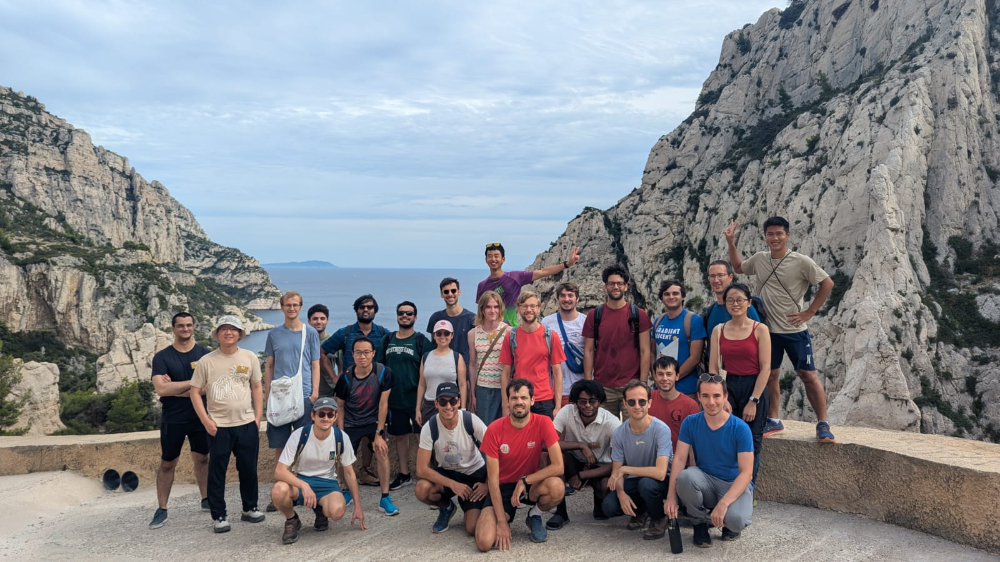

.. _community:

Community
=========

DeepInverse contributors include researchers and practitioners from multiple institutions and companies
around the world, such as in the UK, France, Switzerland, USA, China etc.
We organize hackathons and summer schools on an annual basis,
and we welcome contributions from the community. :ref:`Check out how you can contribute <contributing>`!

.. admonition:: MICCAI 2026
   Attending MICCAI 2026? Find details of the :ref:`DeepInverse tutorial at MICCAI here <miccai2026>`.

.. image:: figures/hackathon_2024.jpg
   :width: 100%
   :alt: deepinverse Hackathon 2024 at CIRM, Marseille, France

Future events
~~~~~~~~~~~~~

- Oct 4-8, 2026: Hands-on tutorial at `International Conference on Medical Image Computing and Computer Assisted Intervention (MICCAI) <https://conferences.miccai.org/2026/en/default.asp>`_, Abu Dhabi, UAE.
- June 17-19, 2026: Keynote lecture at `Grenoble AI for Physical Sciences Workshop <https://indico.math.cnrs.fr/event/15724/>`_ in Grenoble, France.
- Apr 7, 2026: Talk at `PyTorch Conference Europe <https://events.linuxfoundation.org/pytorch-conference-europe/>`_ in Paris, France.

Past events
~~~~~~~~~~~

- Mar 9-10, 2026: Hackathon and tutorial at `Symposium on AI and Reconstruction for Biomedical Imaging <https://www.ccpsynerbi.ac.uk/events/airbi/>`_ in London, UK.
- Dec 10, 2025: Tutorial at `EPFL Center for Imaging <https://memento.epfl.ch/event/imaging-lunch-deepinverse-a-pytorch-library-for-so/>`_ in Lausanne, Switzerland.
- Sep 7-10, 2025: Hackathon at `CIRM <https://conferences.cirm-math.fr/3396.html>`_ in Marseille, France.
- June 9-10, 2025: Summer school tutorial at `Mathematics and Machine Learning for Image Analysis <https://site.unibo.it/mml-imaging/en>`_ in Bologna, Italy.
- June 4-6, 2025: Summer school tutorial at `International Symposium on Computational Sensing <https://www.iscs2025.com/>`_ in Luxembourg.
- Apr 15-17, 2025: Software demo at `International Symposium on Biomedical Imaging <https://biomedicalimaging.org/2025/>`_ in Houston, Texas, USA.
- Feb 24-26 2025: Doctoral school tutorial at `ICMS <https://www.icms.org.uk/>`_ in Edinburgh, UK.
- Nov 26, 2024: the library obtained the documentation award at the `French Open Source Software for Science Awards <https://www.ouvrirlascience.fr/deepinverse>`_.
- Oct 28-30, 2024: Hackathon at `CIRM <https://conferences.cirm-math.fr/3396.html>`_ in Marseille, France.
- June 10-11, 2024: Summer school tutorial at `Mathematics and Machine Learning for Image Analysis <https://site.unibo.it/mathematical-ml-imaging/en/overview>`__ in Bologna, Italy.
