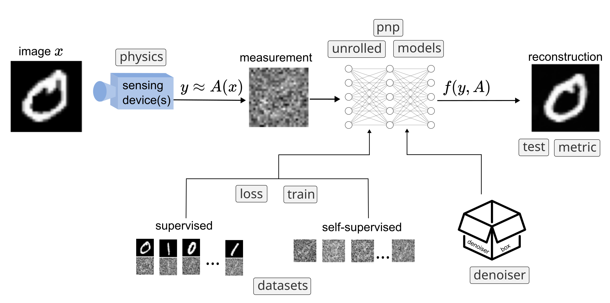

:html_theme.sidebar_secondary.remove:

DeepInverse: a PyTorch library for imaging with deep learning
=============================================================

|Test Status| |Docs Status| |Python Version| |Black| |codecov| |discord| |colab|

DeepInverse is a PyTorch-based library for solving imaging inverse problems with deep learning.

Github repository: `<https://github.com/deepinv/deepinv>`_.

**Featuring**

* |:camera_with_flash:|  Large collection of :ref:`predefined imaging operators <physics>` (MRI, CT, deblurring, inpainting, etc.)
* |:book:| :ref:`Training losses <loss>` for inverse problems (self-supervised learning, regularization, etc.).
* |:boomerang:| Many :ref:`pretrained deep denoisers <denoisers>` which can be used for :ref:`plug-and-play restoration <iterative>`.
* |:book:| Framework for :ref:`building datasets <datasets>` for inverse problems.
* |:building_construction:| Easy-to-build :ref:`unfolded architectures <unfolded>` (ADMM, forward-backward, deep equilibrium, etc.).
* |:microscope:| :ref:`Diffusion algorithms <sampling>` for image restoration and uncertainty quantification (Langevin, diffusion, etc.).
* |:books:| A large number of well-explained :ref:`examples <examples>`, from basics to state-of-the-art methods.

.. toctree::
   :maxdepth: 3
   :hidden:

   quickstart
   auto_examples/index
   user_guide
   API
   finding_help
   contributing
   community

**Lead Developers**

`Julian Tachella <https://tachella.github.io/>`_, `Dongdong Chen <http://dongdongchen.com/>`_,
`Samuel Hurault <https://github.com/samuro95/>`_, `Matthieu Terris <https://matthieutrs.github.io>`_
and `Andrew Wang <https://andrewwango.github.io/about>`_.

.. |Black| image:: https://img.shields.io/badge/code%20style-black-000000.svg
    :target: https://github.com/psf/black
.. |Test Status| image:: https://github.com/deepinv/deepinv/actions/workflows/test.yml/badge.svg
   :target: https://github.com/deepinv/deepinv/actions/workflows/test.yml
.. |Docs Status| image:: https://github.com/deepinv/deepinv/actions/workflows/documentation.yml/badge.svg
   :target: https://github.com/deepinv/deepinv/actions/workflows/documentation.yml
.. |Python Version| image:: https://img.shields.io/badge/python-3.9%2B-blue
   :target: https://www.python.org/downloads/release/python-390/
.. |codecov| image:: https://codecov.io/gh/deepinv/deepinv/branch/main/graph/badge.svg?token=77JRvUhQzh
   :target: https://codecov.io/gh/deepinv/deepinv
.. |discord| image:: https://dcbadge.vercel.app/api/server/qBqY5jKw3p?style=flat
   :target: https://discord.gg/qBqY5jKw3p
.. |colab| image:: https://colab.research.google.com/assets/colab-badge.svg
   :target: https://colab.research.google.com/drive/1XhCO5S1dYN3eKm4NEkczzVU7ZLBuE42J
