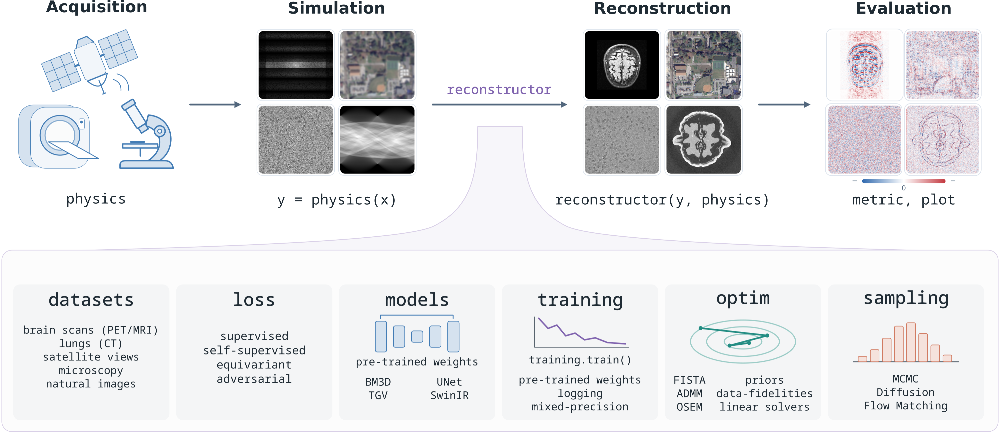

:html_theme.sidebar_secondary.remove:

DeepInverse: a Python library for imaging with deep learning
============================================================

.. toctree::
   :maxdepth: 3
   :hidden:

   quickstart
   auto_examples/index
   user_guide
   API
   auto_benchmarks/benchmarks
   finding_help
   contributing
   community
   changelog

.. container:: landing-intro

    DeepInverse is an open-source PyTorch library for solving imaging inverse problems.
    The library is part of the official `PyTorch Ecosystem <https://pytorch.landscape2.io/?item=modeling--computer-vision--deepinverse>`_. `deepinv` accelerates deep learning research across imaging domains, enhances research reproducibility via a common modular framework of problems and algorithms, and lowers the entrance bar to new practitioners.

.. raw:: html

    <a class="landing-github-card" href="https://github.com/deepinv/deepinv">
        <i class="fa-brands fa-github" aria-hidden="true"></i>
        GitHub
    </a>

Get started
-----------

Check out our :doc:`5 minute quickstart tutorial <auto_examples/basics/demo_quickstart>`,
our :doc:`comprehensive examples <auto_examples/index>`, or our
:ref:`User Guide <user_guide>`.

.. grid:: 1 2 3 3
    :gutter: 3
    :class-container: landing-features

    .. grid-item-card:: Imaging operators

        Model acquisition systems, noise, and forward operators for a wide range
        of imaging problems.

        :ref:`Explore imaging operators <physics_intro>`

    .. grid-item-card:: Neural networks

        Use state-of-the-art architectures, pretrained reconstruction models,
        and denoisers.

        :ref:`Reconstructors <reconstructors>` · :ref:`Pretrained models <pretrained-models>` · :ref:`Denoisers <denoisers>`

    .. grid-item-card:: Reconstruction algorithms

        Build plug-and-play, optimization-based, and unfolded reconstruction
        methods.

        :ref:`Plug-and-play <iterative>` · :ref:`Optimization <optim>` · :ref:`Unfolding <unfolded>`

    .. grid-item-card:: Training losses

        Train models with supervised, self-supervised, and measurement-aware
        objectives for inverse problems.

        :ref:`Explore training losses <loss>`

    .. grid-item-card:: Sampling & diffusion

        Quantify uncertainty and solve inverse problems with sampling algorithms
        and diffusion models.

        :ref:`Explore sampling methods <sampling>`

    .. grid-item-card:: Datasets

        Build and manage datasets that pair images, measurements, and acquisition
        operators.

        :ref:`Build datasets <datasets>`

Works using DeepInverse
-----------------------

Discover how researchers are using DeepInverse in their work.

.. grid:: 1 1 1 1
    :gutter: 3
    :margin: 4 0 4 0
    :class-container: landing-showcase

    .. grid-item-card::
        :shadow: md

        .. container:: landing-showcase-heading

            :bdg-secondary:`Astronomy`

            .. rubric:: Fast uncertainty quantification for weak-lensing mass mapping

        PnPMass combines plug-and-play reconstruction with fast,
        distribution-free uncertainty quantification for weak-lensing mass
        mapping. `See the code
        <https://github.com/hubert-leterme/weaklensing_uq/issues/1>`__.

        .. image:: _static/showcase/pnpmass.png
            :alt: Weak-lensing mass maps reconstructed with MMGAN, DeepMass, PnPMass, and resolved PnPMass
            :class: landing-showcase-image

        **Associated publications** :footcite:p:`leterme2025distribution,leterme2025plugandplay`

        .. footbibliography::

    .. grid-item-card::
        :shadow: md

        .. container:: landing-showcase-heading

            :bdg-secondary:`Remote sensing`

            .. rubric:: Plug-and-play forward backward algorithm to restore Landsat images: A preliminary step to uncover the history of surface waters

        Spec-FB-PnP is a single-image super-resolution method that increases the
        spatial resolution of historical Landsat observations from 30 to 10
        meters, supporting long-term analysis of surface-water evolution.

        .. image:: _static/showcase/landsat.png
            :alt: Sentinel references, synthetic Landsat observations, and Landsat reconstructions produced with bicubic interpolation, SwinIR, and plug-and-play reconstruction
            :class: landing-showcase-image

        **Associated publication** :footcite:p:`audisio2026landsat`

        .. footbibliography::

    .. grid-item-card::
        :shadow: md

        .. container:: landing-showcase-heading

            :bdg-secondary:`Ultrasound`

            .. rubric:: Introduction of a Learned Prior to Passive Cavitation Imaging

        CMF-DEQ combines cross-spectral matrix fitting with a learned denoiser
        in a deep equilibrium framework to improve passive cavitation imaging,
        especially for laterally elongated cavitation clouds.

        .. image:: _static/showcase/ultrasound.png
            :alt: Passive cavitation maps reconstructed with DAS, CMF-spTV, and CMF-DEQ
            :class: landing-showcase-image landing-showcase-image-padded

        **Associated publication** :footcite:p:`lachambre2026learned`

        .. footbibliography::

    .. grid-item-card::
        :shadow: md

        .. container:: landing-showcase-heading

            :bdg-secondary:`Image restoration`

            .. rubric:: PnP-Flow: Plug-and-Play Image Restoration with Flow Matching

        PnP-Flow combines plug-and-play reconstruction with pretrained Flow
        Matching models for denoising, super-resolution, deblurring, and
        inpainting, without backpropagating through ODEs. `See the code
        <https://github.com/annegnx/PnP-Flow>`__.

        .. image:: _static/showcase/pnpflow.png
            :alt: Image restoration results comparing PnP-Flow with PnP-Diff, PnP-GS, OT-ODE, D-Flow, and Flow-Priors
            :class: landing-showcase-image

        **Associated publication** :footcite:p:`martin2025pnpflow`

        .. footbibliography::

Join the community
------------------

.. grid:: 1 1 3 3
    :gutter: 3

    .. grid-item-card:: Looking for help ?

        Search or open a report in the
        `GitHub issue tracker <https://github.com/deepinv/deepinv/issues>`_, or
        get in touch with the
        `maintainers <https://github.com/deepinv/deepinv/blob/main/MAINTAINERS.md>`_.

    .. grid-item-card:: Connect & contribute

        Join the conversation on `Discord <https://discord.gg/qBqY5jKw3p>`_ or
        :ref:`contribute to DeepInverse <contributing>`.

        Meet the :ref:`community <community>`.

    .. grid-item-card:: Stay in the loop

        Occasional updates on releases and new features.

        .. raw:: html

           <link rel="stylesheet" href="_static/subscribe/subscribe.css">
           

           <input id="emailInput" type="email" placeholder="Type your email…" class="substack-clone-input" oninput="validateEmail()"/>
           <button id="subscribeBtn" class="substack-clone-button" disabled onclick="submitAndRedirect()">Subscribe</button>
           

           

Citation
--------
If you use DeepInverse in your research, please cite `our paper on JOSS <https://joss.theoj.org/papers/10.21105/joss.08923>`_:

.. code-block:: bash

    @article{tachella2025deepinverse,
        title = {DeepInverse: A Python package for solving imaging inverse problems with deep learning},
        journal = {Journal of Open Source Software},
        doi = {10.21105/joss.08923},
        url = {https://doi.org/10.21105/joss.08923},
        year = {2025},
        publisher = {The Open Journal},
        volume = {10},
        number = {115},
        pages = {8923},
        author = {Tachella, Julián and Terris, Matthieu and Hurault, Samuel and Wang, Andrew and Davy, Leo and Scanvic, Jérémy and Sechaud, Victor and Vo, Romain and Moreau, Thomas and Davies, Thomas and Chen, Dongdong and Laurent, Nils and Monroy, Brayan and Dong, Jonathan and Hu, Zhiyuan and Nguyen, Minh-Hai and Sarron, Florian and Weiss, Pierre and Escande, Paul and Massias, Mathurin and Modrzyk, Thibaut and Levac, Brett and Liaudat, Tobías I. and Song, Maxime and Hertrich, Johannes and Neumayer, Sebastian and Schramm, Georg},
    }
