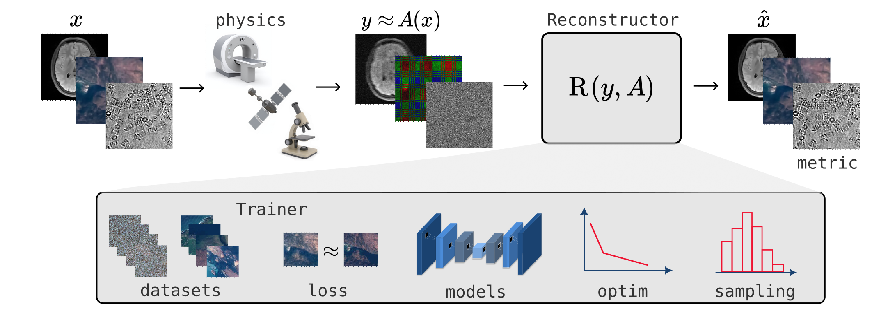

.. deepinverse documentation master file, created by
   sphinx-quickstart on Wed Jan  4 19:22:10 2023.
   You can adapt this file completely to your liking, but it should at least
   contain the root `toctree` directive.

DeepInverse: a Pytorch library for imaging with deep learning
==================================================================

Deep Inverse is a Pytorch based library for solving imaging inverse problems with deep learning. This library provides a large collection of predefined imaging operators (magnetic resonance imaging, computed tomography, compressed sensing, blurring, inpainting, etc.), popular supervised and unsupervised learning losses (noise2x, equivariant imaging, etc.) and unrolled architectures (ADMM, forward-backward, deep equilibrium, etc.).

Getting Started
==================

Here quick guide

.. toctree::
   :maxdepth: 2
   :caption: Contents:

   deepinv.physics
   deepinv.datasets
   deepinv.models
   deepinv.loss
   deepinv.optim
   deepinv.unfolded
   deepinv.pnp
   deepinv.transform
   deepinv.examples

Lead Developers
==================

`Julian Tachella <https://tachella.github.io/>`_, `Dongdong Chen <http://dongdongchen.com/>`_, `Samuel Hurault <https://github.com/samuro95/>`_ and `Matthieu Terris <https://matthieutrs.github.io>`_.

Cite Us
==================

Here how to cite us