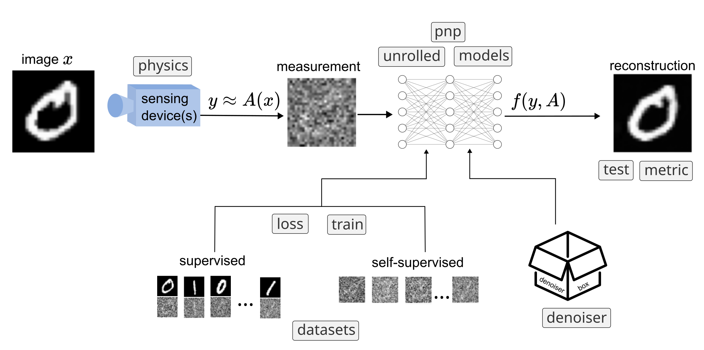

.. _miccai2026:

DeepInverse Tutorial @ MICCAI 2026
==================================

Welcome to the DeepInverse tutorial at `International Conference on Medical Image Computing and Computer Assisted Intervention (MICCAI) <https://conferences.miccai.org/2026/en/default.asp>`_,
Abu Dhabi, **Oct (TBD, 4th or 8th) 2026**.

DeepInverse is an open-source PyTorch-based library for solving imaging inverse problems with deep learning. ``deepinv`` accelerates deep learning research across imaging domains, enhances research reproducibility via a common modular framework of problems and algorithms, and lowers the entrance bar to new practitioners.

.. tip::
   **New to DeepInverse?**

   Check out our `5 minute quickstart tutorial <https://deepinv.github.io/deepinv/auto_examples/basics/demo_quickstart.html>`_,
   our `comprehensive examples <https://deepinv.github.io/deepinv/auto_examples/index.html>`_,
   or our :ref:`User Guide <user_guide>`.

Tutorial description
--------------------

**Scope**: Reconstructing medical images (e.g. MRI, CT, PET, ultrasound) from measurements (e.g. k-space, sinograms) is crucial.
Writing code to reconstruct medical images with AI requires defining many moving parts, such as the imaging operator or network architecture.
At the same time, a growing plethora of algorithms, from diffusion to foundation models, offer to solve the inverse problem.

`DeepInverse <https://deepinv.github.io/>`_ is a modern PyTorch-based open-source library for imaging with deep learning, with state-of-the-art methods contributed by an international community of users and researchers across the globe and 3k monthly users.

In this tutorial, we will show researchers how to use DeepInverse for their own experiments and imaging modalities.
We will do this by walking through our award-winning documentation and comprehensive examples, showing how to inference neural networks on real clinical images, including clinical case studies e.g. using AI to reduce scan time, reduce CT dose etc.
Then, we will provide template notebooks to prompt participants to use DeepInverse tools to reconstruct their own clinical data, such as MRI, CT or ultrasound.
The template notebooks will be crafted around popular MICCAI topics whose methods are available in DeepInverse, such as generative diffusion and GAN models (DPS, DDRM etc.), foundation models for image reconstruction (Reconstruct Anything Model), and uncertainty quantification. 

**Learning objectives**: After the session, all audience members will be able to:

- Write code to reconstruct medical images with AI using the DeepInverse framework and PyTorch.
- Use and train various SotA neural networks algorithms for medical imaging, such as diffusion models, foundation models, and denoising and reconstruction models (SwinIR, Restormer, DRUNet etc.).
- Accelerate their own research using reusable modules in DeepInverse, such as losses, models, datasets, trainers, optimisation objectives and sampling algorithms.
- Enhance reproducibility of their own research by implementing their methods with the common framework.
- Contribute to a modern open-source deep learning library, adopt Python best-practices and join an international community of users.

**Audience**: The target audience is researchers, practitioners, clinicians, engineers and students whose day-to-day involves reconstructing medical images from raw measurements:
- Researchers: use and adapt SotA deep learning algorithms from the modern literature for medical image research;
- Practitioners & clinicians: explore modern open-source deep learning tools for improving clinical workflows and patient experience, for example enhancing noisy images, accelerating scan time, or reducing radiation dose.
- Engineers & students: contribute to an exciting open-source project of deep learning for image reconstruction, with many good first issues and technical coding projects that will improve the user experience for our 3k+ monthly users.

Prerequisites
-------------

There will be a hands-on workshop during the tutorial. So that you can make the most of it, please prepare all prerequisites before attending:

- Laptop (any specification) connected to the internet
- Option 1 (cloud): Familiarity with Google Colab (free, online, GPU access provided, Python installation managed).
- Option 2 (local): Familiarity with local IDE, and already installed Python 3.10+ and PyTorch 2+.
- Basic understanding of `PyTorch <https://docs.pytorch.org/tutorials/beginner/basics/quickstart_tutorial.html>`_.
- Optional: step through our `5 minute quickstart tutorial <https://deepinv.github.io/deepinv/auto_examples/basics/demo_quickstart.html>`_!

Organisers
----------

- `Andrew Wang <https://andrewwango.github.io/about>`_: University of Edinburgh (UK), Inria Saclay (France) and Blur Labs (Paris, France);
- `Julián Tachella <https://tachella.github.io>`_: CNRS and ENS de Lyon (Lyon, France), Blur Labs (Paris, France);
- `Matthieu Terris <https://matthieutrs.github.io>`_: Inria Saclay (France) and Blur Labs (Paris, France).
