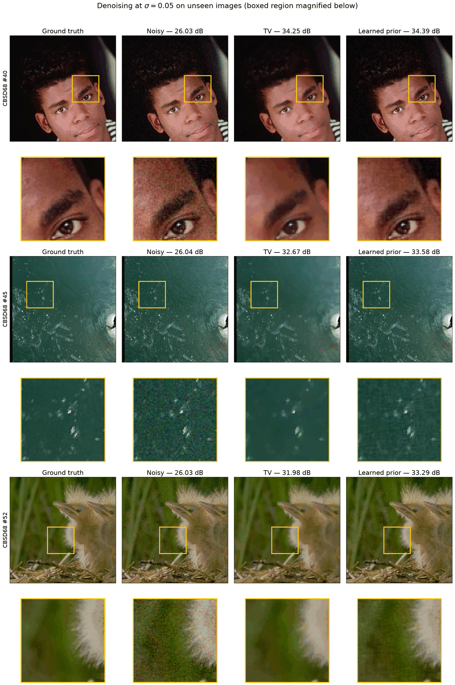
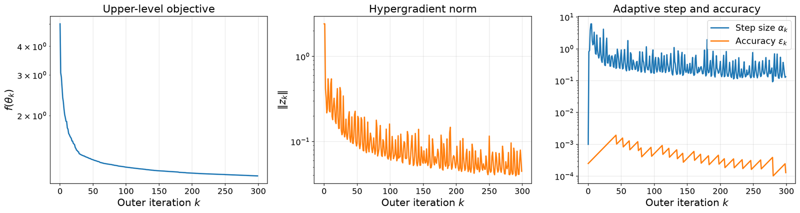

.. _bilevel:

Bilevel learning with MAID
==========================

DeepInverse implementation of the Method of Adaptive Inexact Descent (MAID) for
bilevel hyperparameter learning. The outer loop is solver-agnostic. Everything
that depends on how the lower level is solved, and on which a posteriori bound
certifies the hypergradient error, lives behind a
:class:`~deepinv.optim.bilevel.HypergradientOracle`.

Problem form
------------

.. math::

    \min_\theta f(\theta)
    := \frac{1}{m}\sum_{i=1}^m g_i(\hat x_i(\theta)) + r(\theta)

    \text{s.t.}\quad
    \hat x_i(\theta)
    := \arg\min_x h_i(x, \theta).

The functions :math:`g_i` measure reconstruction quality (typically
:math:`\|x - x_i^\star\|^2`). The functions :math:`h_i` are variational
reconstruction objectives: data fidelity plus a parameterised prior. The
parameter :math:`\theta` is what MAID learns.

References: :footcite:t:`salehi2025adaptively` for MAID and the Theorem 2.1
hypergradient bound; :footcite:t:`bogensperger2025adaptively` for the
saddle-point instantiation with primal-dual style differentiation.

Quick start
-----------

Learning a convex ridge regulariser on a denoising problem. The same pattern
applies to any prior and any physics; only the prior and the forward operator
change.

.. code-block:: python

    import torch
    import deepinv as dinv
    from deepinv.optim.bilevel import (
        MAID,
        MAIDConfig,
        BatchedPriorProblem,
        BatchedMinibatchOracle,
        ConvexRidgePrior2,
    )
    from deepinv.optim.bilevel.convex_ridge import ConvexRidgeConfig

    # x_train: (N, C, H, W) ground truth, y_train: measurements
    physics = dinv.physics.Denoising(
        noise_model=dinv.physics.GaussianNoise(0.05)
    )

    prior = ConvexRidgePrior2(
        ConvexRidgeConfig(nb_channels=(3, 4, 8, 32), filter_sizes=(5, 5, 5))
    )
    theta0 = prior.init_theta(dtype=x_train.dtype, device=x_train.device)

    oracle = BatchedMinibatchOracle([(physics, y_train, x_train)],
                                    cfg=prior.cfg)

    # eps0 and alpha0 default to None, meaning derive them from this problem.
    theta, history = MAID(
        oracle, MAIDConfig(max_iter=300, verbose=True)
    ).run(theta0)

Then reconstruct an unseen measurement with the learned parameters:

.. code-block:: python

    problem = BatchedPriorProblem(
        y=y_test, x_star=x_test, prior=prior, physics=physics
    )
    x_hat, residual, info = problem.solve_lower(theta, eps=2e-6)

    # certificate: ||x* - x_hat|| <= residual / mu
    print(info["residual_rms"], info["reached"])

``history`` records ``f_exact``, ``z_norm``, ``eps``, ``delta`` and ``alpha``
per outer iteration, so a run can be inspected without re-running it.
``verbose=True`` prints the same values as it goes, and states why the run
stopped: reaching the iteration budget, meeting ``tol``, or hitting the
accuracy floor.

For a smaller starting point, a single scalar weight:

.. code-block:: python

    from deepinv.optim.bilevel import (
        TikhonovWeightOracle, TikhonovWeightProblem
    )

    problem = TikhonovWeightProblem(
        physics=physics, y=y, x_star=x_star, solver="GD"
    )
    theta, history = MAID(
        TikhonovWeightOracle(problem),
        MAIDConfig(alpha0=0.5, max_iter=30, g_convex=True),
    ).run(theta0)

See the gallery example
:ref:`sphx_glr_auto_examples_optimization_demo_maid_bilevel.py`.

Learning any prior
------------------

MAID is a bilevel method, not a method for one regulariser. A prior supplies a
single function, the energy of a batch of images,

.. math::

    R_\theta : \mathbb{R}^{B \times C \times H \times W} \to \mathbb{R}^{B},

and everything the algorithm needs follows from it by automatic
differentiation: the lower-level gradient is a backward pass in ``x``, the
Hessian-vector product a second one, and the mixed Jacobian a backward pass in
``x`` followed by one in ``theta``. No derivative is written by hand, and the
solved model and the differentiated model are the same object by construction.

Implement :class:`~deepinv.optim.bilevel.ParametricPrior`:

.. code-block:: python

    class MyPrior(ParametricPrior):
        def __init__(self, channels=3):
            self.n_params = channels

        def energy(self, x, theta):          # -> (B,)
            w = torch.exp(theta).view(1, -1, 1, 1)
            return (w * x.abs()).flatten(1).sum(dim=1)

        def init_theta(self, *, dtype=torch.float64, device="cpu", seed=0):
            return torch.zeros(self.n_params, dtype=dtype, device=device)

and pass it to :class:`~deepinv.optim.bilevel.BatchedPriorProblem`.

Requirements on the energy
^^^^^^^^^^^^^^^^^^^^^^^^^^

**Convex in** ``x``, so the lower level has a unique minimiser and the
certificate :math:`\|x^\star - x\| \le \|\nabla_x h\|/\mu` applies.
**Twice differentiable in** ``x``, so the Hessian-vector product exists;
piecewise-linear activations give convexity but no second derivative.
**Differentiable in** ``theta``, so the hypergradient exists.

Enforce convexity by construction rather than by hoping the optimiser stays
feasible. A weight that must stay positive should be parameterised as
:math:`\exp(\theta)` or ``softplus(theta)``, so no value of ``theta``
produces a non-convex energy.

Two checks are worth running on a new prior, and both are cheap. Assemble the
Hessian on a small image and confirm its smallest eigenvalue is non-negative.
Then compare the hypergradient against a central finite difference of
:math:`g(x^\star(\theta))` along a random direction. For the three priors
supplied here the smallest eigenvalues are 1.00, 1.01 and 10.62, and the
finite-difference agreement is 2.7e-06, 9.9e-07 and 3.3e-05 with cosine
1.000000.

Supplied priors
^^^^^^^^^^^^^^^

.. list-table::
   :header-rows: 1
   :widths: 26 12 62

   * - Prior
     - Parameters
     - Construction
   * - :class:`ConvexRidgePrior2 <deepinv.optim.bilevel.ConvexRidgePrior2>`
     - 7533
     - Multi-convolution ridge regulariser with a smoothed-L1 potential and
       Lipschitz-normalised filters.
   * - :class:`LearnedTVPrior <deepinv.optim.bilevel.LearnedTVPrior>`
     - 3
     - Isotropic total variation with per-channel weights
       :math:`\exp(\theta_c)` and Huber smoothing :math:`\eta` for the
       second derivative.
   * - :class:`ICNNPrior <deepinv.optim.bilevel.ICNNPrior>`
     - 5968
     - Input-convex network: non-negative hidden-to-hidden weights through
       softplus, unconstrained input skips, softplus activation.

Three priors through one path
^^^^^^^^^^^^^^^^^^^^^^^^^^^^^

Denoising at :math:`\sigma = 0.05`, trained on one 32x32 crop from each of 16
distinct CBSD68 images and evaluated on 8 unseen ones. All three priors use
the same oracle, the same solver and the same accuracy and step rules; only
the energy differs. The grid-tuned total variation baseline is the same
isotropic energy with a single weight chosen by search rather than learned.

.. list-table::
   :header-rows: 1
   :widths: 30 12 14 14 18

   * - Prior
     - Parameters
     - PSNR (dB)
     - SSIM
     - Outer iterations
   * - noisy input
     -
     - 26.05
     - 0.5992
     -
   * - total variation, grid-tuned
     - 1
     - 31.28
     - 0.8215
     -
   * - convex ridge regulariser
     - 7533
     - 31.64
     - 0.8499
     - 400
   * - learned total variation
     - 3
     - 30.82
     - 0.8154
     - 25
   * - input-convex network
     - 5968
     - 29.20
     - 0.7452
     - 718 + 600

   Denoising at :math:`\sigma = 0.05` on images unseen in training, with the
   boxed region magnified beneath each panel. Total variation removes noise by
   flattening, which costs texture: the eyebrow hairs, the spray on the wave
   and the down on the chick are smoothed away. The learned prior retains
   them, which is why its advantage is larger in SSIM than in PSNR.

The table shows the same interface carrying priors from three to seven
thousand parameters. It is not a ranking: the budgets differ and no run is
converged, so the figures bound what each prior reached under its own budget
rather than what it can reach.

The learned total variation stops after 25 iterations at the accuracy floor.
It is initialised at the weight the grid search finds, so there is little left
to gain, and its remaining difference from the baseline is the ridge floor
:math:`\gamma` and the Huber smoothing rather than optimisation.

The input-convex network begins with an energy far smaller than the data term,
so early hypergradients are small and the prior must grow before they carry
much information. As it grows the lower level becomes harder, MAID tightens
``eps`` in response, and the accuracy floor stops the run at 718 iterations
with the objective still falling. Warm-starting from those parameters resets
``eps`` from the residual and permits a lower floor, which carried the result
from 28.51 dB to 29.20 dB over 600 further iterations.

A prior that starts far from the data-term scale therefore benefits from a
warm start, and MAID reports which of the two limits it reached, so the choice
between raising the budget and lowering the floor does not require guesswork.

   A typical run. The step size :math:`\alpha_k` and the lower-level accuracy
   :math:`\varepsilon_k` are not monotone: MAID loosens the accuracy while
   steps are accepted and tightens it when the descent test demands, which is
   the behaviour a fixed-accuracy method cannot express.

Scale, not tuning
^^^^^^^^^^^^^^^^^

Hyper-parameters expressed as absolute constants do not transfer between
priors, because the quantities they are compared against are properties of the
regulariser. At the same initialisation on the same data, the hypergradient
norm is 3.7 for the ridge prior, 5.2 for learned total variation and
:math:`6.9 \times 10^4` for an input-convex network. A step size suited to
the first moves the third by roughly 6900 on its first trial.

Two helpers remove the dependence:

* :func:`~deepinv.optim.bilevel.auto_initial_accuracy` sets ``eps0`` to a
  fixed fraction of the stationarity residual at :math:`x_0 = A^\ast y`.
* :func:`~deepinv.optim.bilevel.auto_initial_step` sets ``alpha0`` so the
  first trial step changes the parameters by a fixed relative amount.

.. code-block:: python

    eps0 = auto_initial_accuracy(oracle, theta0, factor=0.02)
    x0, _, _ = problem.solve_lower(theta0, eps=eps0)
    z0 = problem.hypergradient(x0, theta0, delta=eps0)
    alpha0 = auto_initial_step(problem, theta0, z0, rel=0.01)

The energy scale itself also matters. A regulariser whose value at
initialisation is orders of magnitude away from the data term either dominates
the reconstruction or contributes nothing, and in both cases the hypergradient
carries little information. Aim for an initial energy of the same order as
:math:`\tfrac12\|Ax - y\|^2`. Watch for constants: ``softplus(0)`` is
0.693, so a network built from softplus units carries a large offset that
leaves the minimiser unchanged while inflating the derivative in ``theta``,
and near-zero initial weights are not small once passed through it.

Numerical precision and GPU backends
------------------------------------

MAID is usually run in float32, because that is what CUDA and Apple MPS
provide (MPS has no float64 at all: Metal has no ``double`` type). Two
design choices keep the certificate meaningful under that constraint.

**Tolerances are dimensionless.** ``eps`` is a per-element root-mean-square
gradient tolerance, so the solve stops when

.. math::

    \frac{\|\nabla_x h\|}{\sqrt{n}\,\mu} \le \varepsilon ,

with :math:`n` the number of elements. An absolute threshold on the norm
means different accuracy at different resolutions: 1.8e-7 per element at
32x32 and 2.3e-8 at 256x256 for the same nominal value. The floor is derived
from ``torch.finfo(dtype).eps`` rather than hard-coded, so the same rule
applies in float32 and float64.

**Falling short of** ``eps`` **is not an error.** The certificate
:math:`\|x^\star - x\| \le \|\nabla_x h\|/\mu` holds at *any* residual,
so a solve that stalls at the precision floor still returns a valid, merely
wider bound. Raising would discard a correct reconstruction along with a
usable certificate. The reachable residual depends on the problem's
conditioning, the dtype, and FFT error in the Lipschitz normalisation, so it
is detected by observing that the residual has stopped improving rather than
predicted from ``finfo(dtype).eps`` alone. The best iterate is retained,
since the residual is not monotone once it is precision-limited. A solve
still improving when it exhausts ``max_iter`` remains a hard error.

**Float32 hypergradient accuracy.** Against a float64 reference on identical
inputs (same data and probe direction generated in float64 and cast down),
the float32 hypergradient is inexact but not biased:

.. list-table::
   :header-rows: 1
   :widths: 22 20 20 20

   * - configuration
     - rms residual
     - relative :math:`\|\Delta z\|`
     - cosine angle
   * - CPU float64
     - 1.59e-9
     - 0
     - 1.00000000
   * - CPU float32
     - 3.83e-6
     - 2.40e-3
     - 0.99999713
   * - MPS float32
     - 3.83e-6
     - 2.40e-3
     - 0.99999713

The angle is what matters: inexactness shortens the hypergradient, bias would
rotate it, and only rotation threatens the descent test. MPS float32 agrees
with CPU float32 to seven significant figures.

Batched solves and memory-aware batching
----------------------------------------

The samples are independent given :math:`\theta`, so the batched lower-level
Hessian is block diagonal and every operator applies to all samples in one
call. :class:`~deepinv.optim.bilevel.BatchedMinibatchOracle` is a drop-in for
:class:`~deepinv.optim.bilevel.MinibatchOracle` that does this.

Only the *scalars* stay per sample: CG's :math:`\alpha` and :math:`\beta`,
the Armijo step, and the convergence and stall tests. Sharing any of them
would couple independent problems and destroy the Krylov property for all of
them. Converged samples are frozen by zeroing their step rather than dropped,
so the tensor stays rectangular.

Any DeepInverse physics may be used, including operators with per-sample
parameters such as a batched inpainting mask. Batching is valid only when
:math:`A` is block diagonal across the batch, so this is checked at
construction by perturbing one sample and confirming the others'
measurements do not move; a physics that mixes samples is refused rather than
producing incorrect gradients.

**Batch size is measured, not derived.** ``auto_batch_size`` sizes the batch
from ``cuda.mem_get_info`` or, on MPS, ``recommended_max_memory`` minus
current allocation. The per-sample cost comes from two probe runs, taking the
slope so that fixed overhead is not charged per sample, and the probe
includes the hypergradient because the mixed-Jacobian autograd graph is the
peak rather than the solve. Measured on a 12 GiB unified-memory device at a
0.35 safety factor:

.. list-table::
   :header-rows: 1
   :widths: 20 26 26 28

   * - image size
     - MiB per sample
     - batch for 64 samples
     - batch for 512 samples
   * - 32x32
     - 2.87
     - 64
     - 512
   * - 64x64
     - 8.00
     - 64
     - 512
   * - 128x128
     - 36.00
     - 64
     - 117
   * - 256x256
     - 256.05
     - 16
     - 16

Partitioning is numerically free: the hypergradient is a sum over samples, so
batch size changes only peak memory. Splitting eight samples into batches of
three moves :math:`z` by 2e-15 in float64. Batch size is therefore a memory
decision only.

When to use MAID
----------------

MAID spends lower-level iterations on line-search trials that a fixed-accuracy
baseline does not. That overhead only pays when a tight lower-level solve is
expensive.

**Cheap lower level (fixed accuracy wins).** On a 32x32 Tikhonov inpainting
problem solved by DeepInverse ``GD`` with residual stopping, a residual of
``1e-4`` costs about one gradient step per solve. Matched outer-iteration
count (25 steps):

.. list-table::
   :header-rows: 1

   * - method
     - f final
     - BaseOptim iters
     - wall
   * - MAID
     - 47.2152
     - 246
     - 0.086 s
   * - fixed accuracy ``1e-4``
     - 47.2307
     - 26
     - 0.008 s

MAID recorded 16 backtracking failures. Those failed trials, plus successful
line-search probes, are why the BaseOptim count is roughly 9 times larger for
essentially the same upper-level value. Prefer fixed accuracy in this regime.

**Expensive lower level (MAID wins).** On the quadratic least-squares bilevel
problem of Salehi et al. (section 4.1) with lower-level condition number 30,
both methods stop at a relative gap of ``5e-3`` to the closed-form optimum:

.. list-table::
   :header-rows: 1

   * - method
     - GD iters
     - outer steps
     - wall
   * - MAID
     - 60 062
     - 6
     - 0.75 s
   * - fixed accuracy ``1e-4``
     - 129 383
     - 23
     - 1.54 s

The outer-step column is the stronger result. Each upper-level iteration
costs a hypergradient (a full linear solve plus an adjoint). At condition
number 30 MAID uses 6 outer steps against 23 for fixed accuracy, a factor of
nearly 4 on the expensive operation. The gradient-step column (ratio 0.46)
understates that saving.

**Crossover.** Sweeping the lower-level condition number (``n=80``, ``d=4``,
target relative gap ``5e-3``, fixed residual ``1e-4``):

.. list-table::
   :header-rows: 1

   * - condition number
     - GD MAID
     - GD fixed
     - ratio GD
     - outer MAID
     - outer fixed
   * - 2
     - 81
     - 56
     - 1.45
     - 2
     - 2
   * - 5
     - 861
     - 853
     - 1.01
     - 3
     - 5
   * - 10
     - 4 606
     - 5 847
     - 0.79
     - 4
     - 9
   * - 20
     - 17 334
     - 40 691
     - 0.43
     - 5
     - 16
   * - 30
     - 60 062
     - 129 383
     - 0.46
     - 6
     - 23

The scientific claim is therefore: MAID is faster once a tight lower-level
solve costs more than roughly a few thousand gradient steps, and slower below
that. The outer-step ratio improves with condition number as well. Ill-conditioned
physics (motion blur, tomography), weak regularisation, large images, and
nonsmooth priors with many proximal steps are the intended regime. The gallery
example recomputes the flagship, the crossover table and the inpainting
counterpoint from scratch.

Oracles
-------

.. list-table::
   :header-rows: 1
   :widths: 28 22 25 25

   * - Oracle
     - Lower level
     - Hypergradient
     - Error certificate
   * - :class:`~deepinv.optim.bilevel.TikhonovWeightOracle`
     - DeepInverse ``GD`` / ``PGD`` / ``FISTA``
       with residual stopping
     - IFT + CG
     - Theorem 2.1 (certified)
   * - :class:`~deepinv.optim.bilevel.SmoothHypergradientOracle`
     - Hand-rolled GD on quadratic /
       nonquadratic unit-test problems
     - IFT + CG
     - Theorem 2.1 (certified)
   * - :class:`~deepinv.optim.bilevel.SaddleHypergradientOracle`
     - Hand-rolled PDHG on a quadratic saddle
       (``PDCP`` not wired yet)
     - Piggyback adjoint
     - Theorem 2 of arXiv 2412.06436 (certified)
   * - :class:`~deepinv.optim.bilevel.GoalOrientedSmoothOracle`
     - Same as smooth unit-test path
     - IFT + CG
     - Dual-weighted residual estimate (non-certified)

Certified versus non-certified
------------------------------

``oracle.certified`` is ``True`` only for a bound proven in a citable paper
with known constants (in particular a known strong-convexity modulus). An
estimated ``mu`` that is too large makes every bound too small, which is the
dangerous direction: MAID can accept a non-descent direction while the line
search still appears to succeed.

Non-certified oracles require an explicit opt-in:

.. code-block:: python

    from deepinv.optim.bilevel import MAID, GoalOrientedSmoothOracle

    oracle = GoalOrientedSmoothOracle(problem)  # certified is False
    maid = MAID(oracle, allow_uncertified=True)

Convergence in the sense of Theorem 3.19 of the MAID paper is proven only
when **both** of the following hold:

1. ``oracle.certified`` is ``True``, and
2. ``MAIDConfig.check_descent_direction`` is ``True``
   (the a priori test ``omega <= (1 - eta)||z||``).

The default is ``check_descent_direction=False``: every step the line search
accepts still provably decreases the true upper level (Lemma 3.5), but
existence of a valid step size is no longer guaranteed a priori. Backtracking
failure is the a posteriori detector and is counted in
``history["n_backtrack_failures"]``.

DeepInverse optimiser residuals
-------------------------------

:mod:`deepinv.optim.bilevel.base_optim_lower` drives
:class:`~deepinv.optim.BaseOptim` subclasses with residual stopping, not
the default fixed-point residual ``||x_{k+1}-x_k||``.

.. list-table::
   :header-rows: 1

   * - Solver
     - Residual
     - Why
   * - ``GD``
     - Gradient residual
       ``||grad data + lambda grad prior||``
     - Smooth objective; strong convexity gives
       ``||x-xhat|| <= residual / mu``
   * - ``PGD``, ``FISTA``
     - Proximal residual
       ``||x - prox(x - gamma grad f)|| / gamma``
     - Stationarity measure for composite
       ``f + lambda g``; reduces to the gradient
       residual when the prox is a gradient step
   * - ``ADMM``, ``DRS``, ``PDCP``, ...
     - Not wired
     - No honest residual criterion is exposed yet;
       do not guess

Warm starts pass the previous reconstruction through the ``init`` argument of
:meth:`~deepinv.optim.BaseOptim.forward` (for FISTA both primal and
extrapolated points are set).

Unifying fact (Lemma 1 of arXiv 2412.06436): if :math:`\Phi` is
:math:`\mu`-strongly convex with minimiser :math:`x_\star`, then

.. math::

    \|x_\star - x\| \le \frac{1}{\mu}\,\|\nabla\Phi(x)\|.

Every residual-based distance bound used by an oracle is a variant of this.

Goal-oriented error estimate
----------------------------

The certified Theorem 2.1 bound is often loose (median factor about 4 to 25
on quadratic tests, up to thousands). The goal-oriented estimator forms

.. math::

    z - \nabla f
    \approx J^\top H^{-1} r
    - J^\top H^{-1} G H^{-1} \nabla_x h(\bar x),

with a default ``safety_factor=1.25`` and ``cg_budget=5``. Measured ratios
(estimate / true error):

**Quadratic** (dim 200, 72 configs, supervisor):

.. list-table::
   :header-rows: 1

   * - estimator
     - median ratio
     - max
     - under-estimates
   * - certified ``omega``
     - 24.5
     - 38.0
     - 0/72
   * - DWR raw, budget 5
     - 0.994
     - 1.015
     - 59/72
   * - DWR × 1.25
     - 1.25
     - 1.27
     - 0/72

**Nonquadratic** (log-cosh prior, data-scale sweep, raw DWR budget 5):

.. list-table::
   :header-rows: 1

   * - data scale
     - sech² spread
     - DWR median
     - DWR min
     - safety needed
   * - 1.0
     - 0.06
     - 1.0014
     - 0.9790
     - 1.02
   * - 5.0
     - 0.71
     - 1.0021
     - 0.9792
     - 1.02
   * - 20.0
     - 0.9996
     - 0.9956
     - 0.9791
     - 1.02

The default safety factor 1.25 is about twelve times the observed requirement
across these regimes. The estimator remains non-certified.

Accelerated MAID
----------------

Two optional switches on :class:`~deepinv.optim.bilevel.MAIDConfig`
(both off by default, so Algorithm 3.1 is unchanged):

* ``nonmonotone=True``: Zhang-Hager window reference ``C_k`` in place of
  ``U_lower`` at the current point, with a monotone Lemma 3.5 fallback so a
  sandwich-depressed ``C`` cannot block a valid step. Proof sketch in the
  :mod:`deepinv.optim.bilevel.maid` module docstring (not claimed as proven).
* ``bb_init=True``: Barzilai-Borwein initial step from
  ``s = theta_k - theta_{k-1}``, ``y = z_k - z_{k-1}``, clamped, with
  fallback ``rho_bar * alpha_k``. Changes only where backtracking starts.

:func:`~deepinv.optim.bilevel.accelerated_maid_config` enables both.

The acceptance gap ``U_upper - U_lower`` is pure inexactness penalty. When
``eps`` is loose that gap is wide, backtracking fails, and MAID pays on
cheap problems. Nonmonotone acceptance and BB steps target that mechanism.

**Three-way crossover** (same protocol as above: relative gap ``5e-3``,
``n=80``, ``d=4``, fixed residual ``1e-4``):

.. list-table::
   :header-rows: 1

   * - cond
     - GD fixed
     - GD MAID
     - GD acc.
     - ratio MAID
     - ratio acc.
     - BT MAID
     - BT acc.
   * - 2
     - 56
     - 81
     - 67
     - 1.45
     - 1.20
     - 3
     - 2
   * - 5
     - 853
     - 861
     - 497
     - 1.01
     - 0.58
     - 4
     - 2
   * - 10
     - 5 847
     - 4 606
     - 1 198
     - 0.79
     - 0.20
     - 5
     - 1
   * - 20
     - 40 691
     - 17 334
     - 8 025
     - 0.43
     - 0.20
     - 5
     - 3
   * - 30
     - 129 383
     - 60 062
     - 25 037
     - 0.46
     - 0.19
     - 6
     - 4

Vanilla MAID crosses below ratio 1 near condition number 5 to 10.
Accelerated MAID is already cheaper at condition number 5 (ratio 0.58) and
cuts the ratio to about 0.20 above that. At condition number 2 it still loses
to fixed accuracy (1.20 vs 1.45 for vanilla), so the cheap end is improved
but not inverted. Backtracking failures drop at every condition number.

**Inpainting counterpoint** (same 32x32 Tikhonov setup, ``max_iter=25``):

.. list-table::
   :header-rows: 1

   * - method
     - f final
     - BaseOptim iters
     - BT failures
   * - MAID
     - 47.2152
     - 246
     - 16
   * - accelerated MAID
     - 47.2152
     - 24
     - 1
   * - fixed accuracy ``1e-4``
     - 47.2307
     - 26
     - n/a

Accelerated MAID cuts backtracking failures from 16 to 1 and BaseOptim
iterations from 246 to 24, matching fixed accuracy on this cheap problem.
The acceleration targets that line-search overhead.

Nesterov or heavy-ball momentum on ``theta`` is not included: it would move
the search direction away from ``-z`` and break Proposition 3.1. Future work.

**Ablation on a real imaging problem.** The crossover above is on synthetic
quadratics. On bilevel learning of a convex ridge regulariser (CBSD68, 16
training images, 120 outer iterations, MPS float32, batched oracle), with
everything else held fixed:

.. list-table::
   :header-rows: 1
   :widths: 14 16 14 14 14 14 14

   * - arm
     - ``f`` final
     - :math:`\|z\|`
     - lower-level its
     - wall (s)
     - held-out PSNR
     - monotone
   * - plain
     - 2.607
     - 2.38e-1
     - 1326
     - 131
     - 28.08 dB
     - yes
   * - ``bb_init``
     - 1.190
     - 1.32e-1
     - 3593
     - 627
     - 31.54 dB
     - yes
   * - ``nonmonotone``
     - 2.537
     - 3.21e-1
     - 1295
     - 124
     - 28.21 dB
     - yes
   * - both
     - **1.147**
     - **6.11e-2**
     - 3377
     - 724
     - **31.73 dB**
     - no

Barzilai-Borwein initialisation carries almost all of the benefit: it more
than halves the objective and adds 3.46 dB held-out. Zhang-Hager alone is
near noise on this problem (+0.13 dB), though it does reduce backtracking
failures from 7 to 4, and combined with BB it reaches the lowest
:math:`\|z\|` by a factor of four. Only the combined arm is non-monotone,
which shows that the window reference is active rather than inert.

The table is an equal-iteration comparison, not equal-time. The BB arms
spend 2.7 times the lower-level iterations and roughly five times the wall
clock, because larger trial steps demand tighter solves. No equal-wall-clock
comparison of ``plain`` against the BB arms is reported, so no
per-unit-compute claim is made here.

Minibatch accumulation
----------------------

When ``f`` is a mean over ``m`` samples, :class:`~deepinv.optim.bilevel.MinibatchOracle`
walks the dataset in fixed-order chunks and accumulates the inexact
hypergradient without weakening the a posteriori bound.

**Reduction order (determinism).** Samples are processed in index order
``0, ..., m-1``. Accumulators use sequential floating-point addition, then a
single division by ``m``. Chunk size controls only concurrent working memory.
With a fixed seed the accumulated hypergradient is bitwise identical across
runs and bitwise invariant to chunk size.

**Error bound for the mean.** If ``||z_i - grad f_i|| <= omega_i``, then

.. math::

    \Bigl\|
      \tfrac1m\sum_i z_i - \tfrac1m\sum_i \nabla f_i
    \Bigr\|
    \le \tfrac1m\sum_i \omega_i.

So ``omega_mean = (1/m) sum_i omega_i`` is the certificate Algorithm 3.2 must
use. Using a single-sample ``omega`` or a max would either under-bound or
over-bound the mean; the mean of the bounds is the correct aggregation.

**Memory adaptivity does not change the mathematics.** Chunk sizes 1 and
``m`` produce bitwise identical MAID trajectories (same ``f``, ``theta``,
step sizes) under the fixed reduction.

Peak working memory for the accumulation is bounded by the chunk, not by
``m``. Measured on float64 sample states of length ``d = 200000``
(1.53 MB each), by counting concurrent tensor bytes during the fixed-order
pass (CPU; peak working memory counted without ``torch.cuda``):

.. list-table::
   :header-rows: 1

   * - m
     - chunk
     - peak working (MB)
     - warm-start storage (MB)
   * - 16
     - 4
     - 6.10
     - 24.4
   * - 32
     - 4
     - 6.10
     - 48.8
   * - 64
     - 4
     - 6.10
     - 97.7
   * - 128
     - 4
     - 6.10
     - 195.3

Peak working is flat in ``m``. Warm-start storage is ``O(m)`` by design
(one reconstruction per sample). Against chunk size at fixed ``m = 64``:

.. list-table::
   :header-rows: 1

   * - chunk
     - peak working (MB)
   * - 1
     - 1.53
   * - 2
     - 3.05
   * - 4
     - 6.10
   * - 8
     - 12.2
   * - 16
     - 24.4

**Goal-oriented estimator.** Each sample has its own Hessian. The three DWR
adjoint solves and any Krylov recycling are per sample; recycling does not
span a chunk. Cost is ``m`` times the per-sample DWR cost, independent of
chunk size.

**Cost honesty on the multi-sample path.** On a mean of ``m = 4`` section-4.1
problems at condition number 20, chunk size 2, 10 outer steps for MAID,
warm-started fixed accuracy ``1e-4`` to each method's final ``f`` (fresh
problem objects per method so ``n_gd_iters`` is not shared):

.. list-table::
   :header-rows: 1

   * - method
     - f final
     - GD steps
     - sample lower
     - BT
     - wall (s)
     - GD / fixed
   * - vanilla MAID
     - 43.79
     - 355 611
     - 1 168
     - 11
     - 4.33
     - 2.88
   * - fixed to vanilla ``f``
     - 43.83
     - 123 646
     - 72
     - n/a
     - 1.57
     - 1
   * - accelerated MAID
     - 43.70
     - 144 294
     - 688
     - 7
     - 1.76
     - 0.90
   * - fixed to accel ``f``
     - 43.74
     - 160 380
     - 100
     - n/a
     - 1.98
     - 1

Vanilla MAID loses on both GD and wall. The structural cause is line search:
each trial re-solves all ``m`` samples (1168 sample-lower calls against 72).
Hypergradient and certified ``omega`` remain under 1 percent of wall; the
goal-oriented estimator is not on this path.

Accelerated MAID is the measurement that matters on this path. Every avoided
backtracking failure saves ``m`` lower-level solves rather than one.
Here sample_lower drops from 1168 to 688, GD from 355611 to 144294, and the
GD ratio against fixed flips from 2.88 to 0.90. Wall follows (0.89x fixed).

Cost table over condition number (``max_iter=8``, fixed to each method's
``f``; ``rg`` is GD MAID / GD fixed):

.. list-table::
   :header-rows: 1

   * - cond
     - GD van
     - GD acc
     - GD fixed (to van)
     - sl van
     - sl acc
     - BT van
     - BT acc
     - rg van
     - rg acc
   * - 5
     - 17 112
     - 5 518
     - 5 097
     - 976
     - 588
     - 10
     - 6
     - 3.36
     - 0.60
   * - 10
     - 73 693
     - 22 514
     - 23 200
     - 1 108
     - 664
     - 11
     - 7
     - 3.18
     - 0.97
   * - 20
     - 284 232
     - 72 970
     - 101 860
     - 1 060
     - 576
     - 10
     - 6
     - 2.79
     - 0.68

Each method uses independent problem objects and counters. Sharing objects
would sum MAID and fixed steps into one GD total (for example
355611 + 123646 = 479257) and overstate fixed-accuracy cost.

Chunking is a memory control with bitwise trajectory invariance. With
vanilla MAID it is not a free speedup on the multi-sample line-search path.
With acceleration it is competitive on cost as well.

API
---

See :mod:`deepinv.optim.bilevel` and the optim API page.

References
----------

.. footbibliography::
